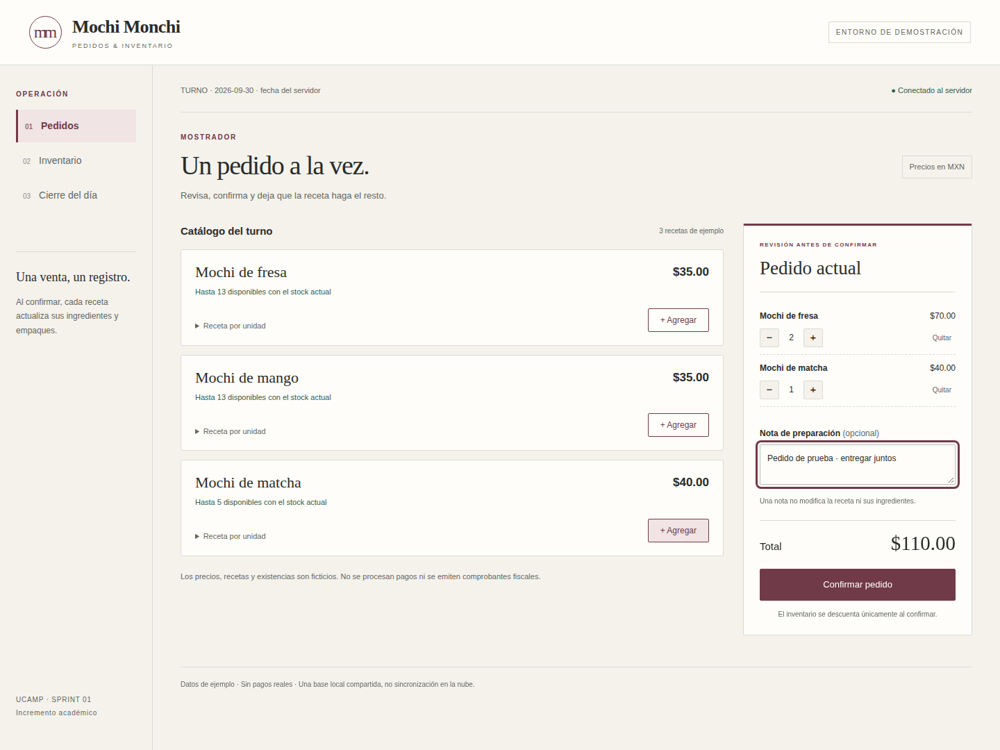

# Mochi Monchi · Sprint 1

Incremento académico del sistema de pedidos e inventario, construido a partir del MVP de [Semana 3](../Semana3_SCRUM/User_Story_Mapping_MVP.md). Interfaz local de navegador, servidor Python y una sola base SQLite. No es un sistema de cobro ni una versión lista para producción.

## Entrega

[Observaciones del Sprint](Observaciones_del_Sprint.md) · [Plantillas y consolidado](documentos/) · [Evidencias](evidencias/) · [Texto para Community](ENTREGA_COMMUNITY.txt)



## Ejecutar

Se necesita **Python 3.11 o posterior**. No hay dependencias externas para usar la aplicación.

En Windows, abrir `Iniciar_Mochi_Monchi.bat`. También puede iniciarse desde esta carpeta:

```bash
python app/server.py --open
```

El programa muestra una dirección de acceso con una clave temporal. Usar esa dirección completa en el navegador. La base se crea en `data/mochi.sqlite3`; los productos, recetas, precios y existencias iniciales son **de demostración**. Las ventas se conservan al cerrar. Reiniciar no restablece el stock. No borrar la base para corregir una operación real; este incremento todavía no implementa cancelaciones o ajustes.

Para una demostración nueva sin tocar datos anteriores:

```bash
python app/server.py --db data/otra_demostracion.sqlite3 --port 8766 --open
```

### Otro dispositivo en la misma red

```bash
python app/server.py --host 0.0.0.0
```

En el segundo dispositivo se utiliza la IP privada del equipo servidor, el puerto y el fragmento con la clave que muestra la terminal. Ambos deben estar en una red confiable y el firewall debe permitir esa conexión local. Nunca abrir puertos del router ni exponer el servidor a Internet. El transporte HTTP de esta demo no está cifrado; quien tenga la clave comparte todo el acceso. No hay usuarios, roles ni nube. El escenario de dos dispositivos físicos no ha sido validado por esta entrega.

## Qué hace

| Recorrido | Función |
|---|---|
| Revisar turno | Catálogo con precios, recetas y disponibilidad; stock con umbrales. |
| Registrar | Pedido de varios productos, cantidades y nota informativa. |
| Confirmar | Total calculado por el servidor; persistencia y descuento atómico de ingredientes y empaques. |
| Consultar | Existencias actualizadas; rechazo sin cambios cuando falta stock. |
| Cerrar | Pedidos y total del día; valoración de 1 a 5 y comentario opcional. |

Una nota no modifica la receta. Se usan cantidades enteras y dinero en centavos. Reintentar el mismo envío no crea otra venta. Si la respuesta se pierde, la interfaz conserva el identificador y permite reintentar en la misma sesión del navegador, sin editar ese envío pendiente. No se garantiza esa recuperación al borrar el almacenamiento o cambiar de dispositivo.

## Comprobar

Desde la raíz del repositorio:

```bash
python -m unittest discover -s Retos_M5/Semana4_SCRUM/tests -v
python -m compileall -q Retos_M5/Semana4_SCRUM
```

La suite contiene **44 pruebas**, sin APIs externas: validación, persistencia, fecha del cierre, idempotencia, transacciones, concurrencia y contrato HTTP. No requiere Playwright.

Sólo para la comprobación visual reproducible:

```bash
python -m pip install playwright
python -m playwright install chromium
python Retos_M5/Semana4_SCRUM/tools/verify_browser.py
```

El script inicia bases temporales, recorre nueve comprobaciones y genera seis capturas reales. Dos contextos de navegador no equivalen a dos dispositivos físicos. `evidencias/verificacion_navegador.json` indica si la ejecución fue nativa o si usó el modo de puente HTTP del entorno restringido. El modo de puente no valida navegación nativa ni políticas de seguridad del navegador.

## Organización

- `app/`: servidor y archivos de la interfaz.
- `tests/`: pruebas de lógica y HTTP.
- `evidencias/`: capturas y resultados verificables, siempre con datos sintéticos.
- `documentos/`: Semana 2, Semana 4 y PDF consolidado.
- `tools/`: generación de documentos y comprobación visual; no se necesita para utilizar el producto.

## Decisiones y límites

El MVP original planteó una aplicación de escritorio. Este Sprint implementa un servidor local con interfaz de navegador para mantener una base compartida y evitar instalar una interfaz distinta por dispositivo. Requiere Python: no es un `.exe` autónomo. Mantiene el recorrido del MVP, pero su modalidad de entrega queda documentada para validación posterior.

SQLite mantiene pedido e inventario en una sola transacción. La API recalcula importes y acumula el consumo de ingredientes compartidos. La clave temporal, las rutas estáticas permitidas y los límites de entrada reducen riesgos de la demostración; no convierten `http.server` en un servidor de producción.

Fuera de alcance: pagos, tickets, edición/cancelación, reposición y editor de recetas, cuentas de usuario, exportaciones, nube y multi-sucursal. El cierre usa la fecha local del servidor. No se han medido ahorros de tiempo ni satisfacción de clientes reales.

## Scrum y entrega académica

La [Semana 4](Observaciones_del_Sprint.md) contiene una **simulación individual** de cinco jornadas virtuales y distingue ese guion de las pruebas que sí se ejecutaron. No presenta reuniones ficticias como reales. Las reflexiones personales deben ser revisadas por el estudiante antes de entregar.

Continuidad: [Semana 2](../Semana2_SCRUM/Product_Vision_Board.md) · [Semana 3](../Semana3_SCRUM/User_Story_Mapping_MVP.md). El proceso y las referencias están en el documento de observaciones. Publicar estos archivos en GitHub no equivale a enviarlos a Community.
